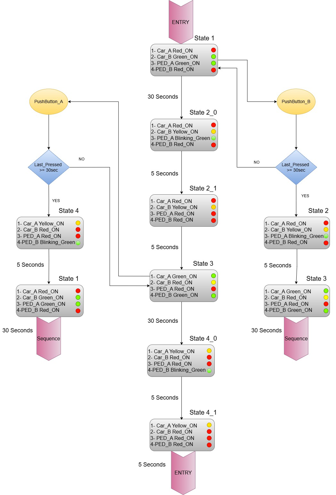
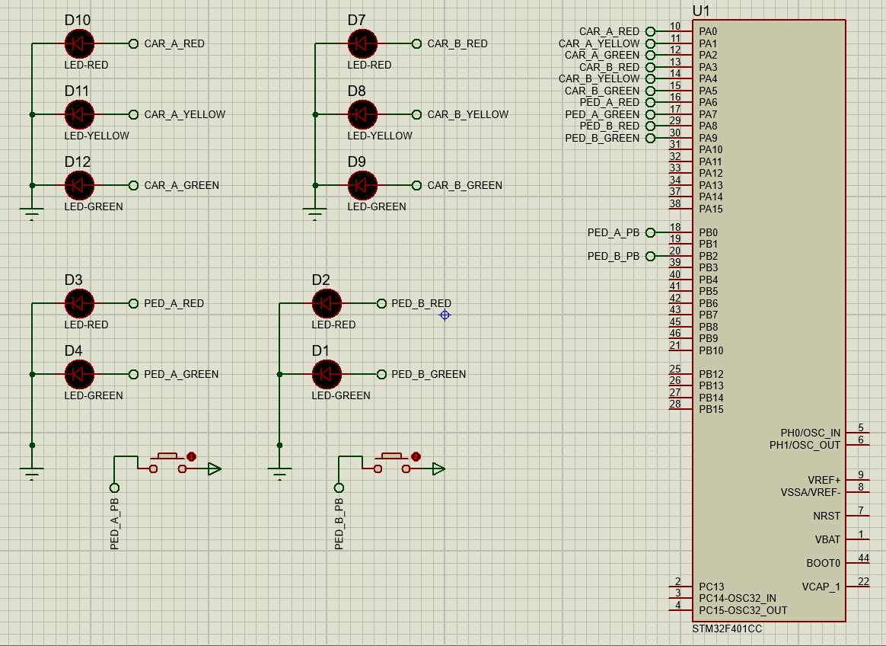

# Four way crossing Traffic Light and pedastrian crossing traffic light using ARM Cortex-M STM32F401CC

## Overview

This project manages and coordinates a typical four way crossing for cars and pedestrians allowing for smooth traffic flow supporting
pedastrain crossing requests while protecting the system against any abusive behaviour ensuring a well maintained traffic flow.

## Features

- **Four Way Traffic Light Control:** has its own traffic light system.
- **Pedestrian Traffic Lights:** Pedestrian lights operate in synchronization with the vehicle lights to ensure safety .
- **Pedestrian Pushbutton :** Pedestrians can press a button to request crossing.
- **Pedestrian Override Functionality:** System is protected against abusive behaviour (Many pedastrain crossing requests in a short time).

## How It Works

1. **All traffic and pedestrian lights are set to their initial states for 30 sec:**

- Car Traffic Light A (Red Light ON).
- Pedestrian Traffic Light A (Green Light ON).
- Car Traffic Light B (Green Light ON).
- Pedestrian Traffic Light B (Red Light ON).

2. **Second State for 10 sec:**

- Car Traffic Light A (Red Light ON).
- Pedestrian Traffic Light A (Green Light Blinking for 5 sec then turns red for 5 sec).
- Car Traffic Light B (Yellow Light ON).
- Pedestrian Traffic Light B (Red Light ON).

3. **Third State for 30 sec:**

- Car Traffic Light A (Green Light ON).
- Pedestrian Traffic Light A (Red Light ON).
- Car Traffic Light B (Red Light ON).
- Pedestrian Traffic Light B (Green Light ON).

4. **Fourth State for 10 sec:**

- Car Traffic Light A (Yellow Light ON).
- Pedestrian Traffic Light A (Red Light ON).
- Car Traffic Light B (Red Light ON).
- Pedestrian Traffic Light B (Green Light Blinking for 5 sec then turns red for 5 sec).

5. **Pedestrian crossing request:**

- If Push Button A is pressed while in State 3 or Push Button B is pressed while in State 1 and This is the first crossing request in the last 30 sec
- The system will go to state 4 then state 1 for Push button A request
- The system will go to state 2 then state 3 for Push button B request
- Then the system will continue to operate normally.

## Components

- **ARM Cortex-M STM32F401CC Microcontroller:** Core processor handling all logic and control operations.
- **10\*LED:** LED Lights for each direction (Green, Yellow, and Red for Cars) (Green and Red for pedestrians).
- **Pushbuttons:** Pushbuttons for Pedestrian Requests.
- **Power Supply:** Supplies power to the STM32 microcontroller and LEDs .

## Hardware Connections

- **LED Connections:**
- PORTA
- CAR_A_RED -> PIN0
- CAR_A_YELLOW -> PIN1
- CAR_A_GREEN -> PIN2
- CAR_B_RED -> PIN3
- CAR_B_YELLOW -> PIN4
- CAR_B_GREEN -> PIN5
- PED_A_RED -> PIN6
- PED_A_GREEN -> PIN7
- PED_B_RED -> PIN8
- PED_B_GREEN -> PIN9

- **PUSH Button Connections:**
- PORTB
- PED_A_PB -> PIN0
- PED_B_PB -> PIN2

## Getting Started

### Prerequisites

- ARM Cortex-M STM32F401CC Microcontroller
- LEDs, Push Buttons and basic electronic components
- Eclipse or any compatible IDE
- ARM GCC Toolchain (`arm-none-eabi-gcc`)

## Contact

For questions or feedback, feel free to reach out via [Email](mahmoudd.essam1@gmail.com) or [LinkedIn](www.linkedin.com/in/mahmoud-essam-b66b8a244).
